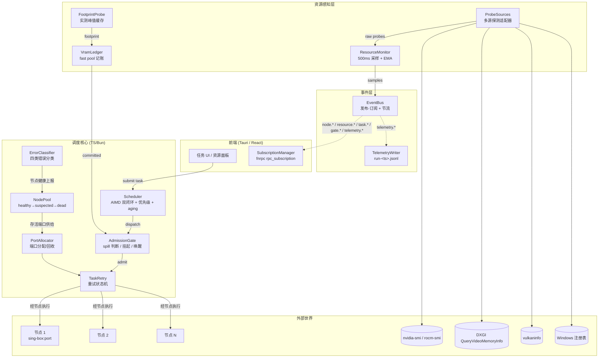
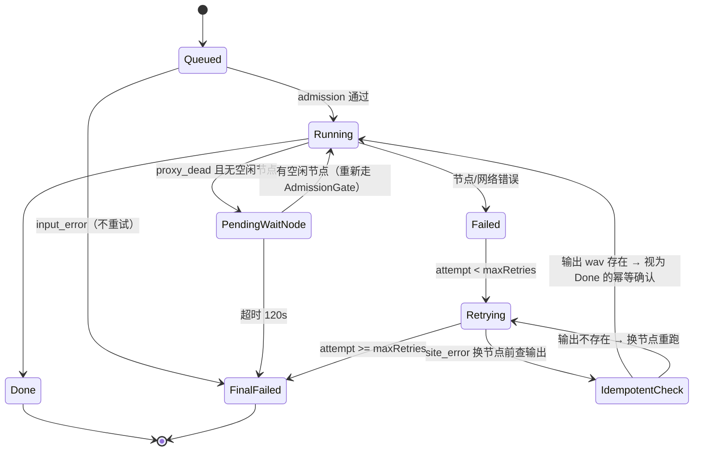
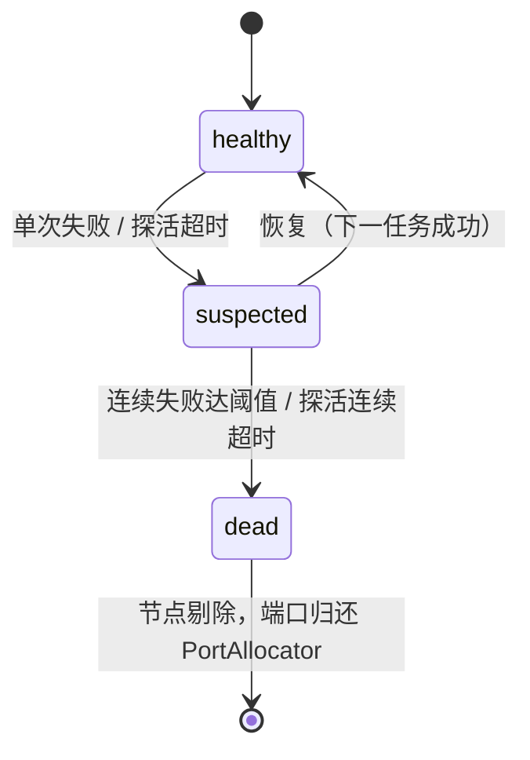

# Node Pool Scheduler — 自适应节点池调度架构

> 状态：设计基线（原型落地于 `packages/tmp/tts-node-pool/`）
> 关联文档：[GTT.md](./GTT.md)、[architecture.md](./architecture.md)、[webgpu-oom.md](./webgpu-oom.md)

## 1. 背景与目标

多轮讨论确认的需求：

1. **每次运行实时读取每个阶段花费的资源/显存情况**——设备不同、使用方式不同，显存会有变化；
2. 依据**剩余资源**判断任务能否开启——某个阶段现在可以直接开启，还是先挂起等待；
3. 节点（站点端口）出错时，**分配下一个空闲节点重新尝试**；若无空闲节点则**挂起等待**；
4. 前端能够**订阅节点资源管理**状态（实时推送）。

核心设计原则：

- **不写设备类型分支**：APU/dGPU 差异只体现为探测到的参数（两层速度比、fast pool 总量、允许溢出），代码路径统一；
- **多源探测、字段可为 null、统一降级**：任一探测源失败不阻塞调度，账本永远兜底；
- **事件驱动而非轮询**：挂起/唤醒用条件变量式通知；遥测节流避免刷屏。

## 2. 系统组件架构



## 3. 统一资源模型（fast / slow pool）

所有 GPU 统一抽象为两层内存，**不区分设备类型**，设备差异只体现在参数上：

| 层 | dGPU | APU (780M 类) | 说明 |
|----|------|---------------|------|
| **fast pool** | GDDR | carveout（BIOS 预留） | 高带宽，调度只认这一层 |
| **slow pool** | PCIe GTT | 系统内存 GTT | 低带宽，交换极慢 |

**速度比参数**（`fastSlowRatio`，只用于宽松模式提示）：

| 设备 | 速度比 | 默认策略 |
|------|--------|----------|
| dGPU | ~10:1 | 严格：spill>0 即挂起 |
| APU | ~1.2:1 | 允许溢出，遥测标记 |
| 未知 | 8:1（保守） | 严格 |

### 预算公式

```
committed   = VramLedger 累计已承诺 footprint（仅 fast pool）
spill       = max(0, committed + footprint − fastPoolTotal)
usedEffective = max(probedUsed ?? 0, committed)     // 账本永远兜底
available   = fastPoolTotal × 0.9 − usedEffective   // 0.9 安全系数
```

- `spill == 0`：立即开启；
- `spill > 0`：严格模式挂起（`gate.waiting`）；允许溢出模式开启但遥测标记 `spillOver=true`；
- 所有字段可为 null：`probedUsed` 探测失败时为 null，`?? 0` 后由账本覆盖。

## 4. 统一探测管道

| 探测源 | total | used | 平台 | 实时性 | 备注 |
|--------|:-----:|:----:|------|--------|------|
| nvidia-smi | ✅ | ✅ | 全平台 | 是 | `--query-gpu=memory.total,memory.used`；**Windows 上 `2>/dev/null` 会拖垮整条命令（见 §10）** |
| rocm-smi --showmeminfo | ✅ | ✅ | Linux + AMD | 是 | `VRAM / VIS_VRAM / GTT` 精确区分；仅 dGPU |
| DXGI `IDXGIAdapter3::QueryVideoMemoryInfo` | ✅ | ✅ | Windows | 是 | `LOCAL`（fast）/ `NON_LOCAL`（slow）两组 `Budget + CurrentUsage`，全系统占用，**全厂商全 GPU**（重点新增源） |
| vulkaninfo DEVICE_LOCAL heap | ✅ | ❌ | 全平台 | 否 | 兜底；dGPU 上 = GDDR，**APU 上混 GTT（Vulkan 规范无 LOCAL 标志，无法区分）** |
| Windows 注册表 `HardwareInformation.qwMemorySize` | ✅ | ❌ | Windows | 否 | 静态兜底；**不要用 `Win32_VideoController.AdapterRAM`（32 位有符号溢出）** |

合并规则（按可信度优先级，字段级合并）：

1. `fastPoolTotal`：nvidia-smi/rocm-smi > DXGI LOCAL Budget > vulkaninfo DEVICE_LOCAL > 注册表；
2. `usedEffective = max(probedUsed ?? 0, ledgerCommitted)`；
3. 按 `vendor|基础名称` 去重（沿用现有 `getGpuInfo` 的 `normName` 逻辑）。

```mermaid
flowchart LR
    A[探测请求] --> B{nvidia-smi?}
    B -- yes --> C[total+used]
    B -- no --> D{rocm-smi?}
    D -- yes(Linux AMD) --> E[VRAM/VIS_VRAM/GTT]
    D -- no --> F{Windows?}
    F -- yes --> G[DXGI LOCAL/NON_LOCAL<br/>Budget+CurrentUsage]
    F -- no --> H[vulkaninfo DEVICE_LOCAL<br/>total only]
    G -- 失败 --> I[注册表 qwMemorySize<br/>total only]
    H --> J[合并<br/>usedEffective = max(probedUsed ?? 0, committed)]
    C & E & G & I --> J
```

## 5. 事件订阅层

### 5.1 通道表

| 通道 | 载荷要点 | 频率 | 消费者 |
|------|----------|------|--------|
| `node.registered` | 节点 id、端口、站点 | 事件 | NodePool、前端 |
| `node.healthy` | 节点 id、健康度 | 变化时 | NodePool、前端 |
| `node.suspected` | 节点 id、原因 | 事件 | NodePool、前端 |
| `node.dead` | 节点 id、原因、死亡时间 | 事件 | NodePool、PortAllocator |
| `resource.snapshot` | `{cpuPct, memFree, vramTotal, vramUsed, gpuSessions, rss, spill}` | **1Hz 节流** | Scheduler、前端 |
| `resource.gpu.*` | 单 GPU 明细 | 变化时 | 前端 |
| `task.queued` / `task.running` / `task.done` / `task.failed` / `task.retrying` | taskId、attempt、节点 | 事件 | 前端 |
| `task.waiting` | taskId、原因（`hint`：`no_vram`/`no_cpu`/`no_node`/`site_down`）、等待时长 | 事件 | 前端 |
| `gate.admitted` / `gate.parked` | taskId、spill、footprint | 事件 | Scheduler、前端 |
| `telemetry.sample` | 阶段级 {cpuPct, memFree, vramUsed, spill, waitReason, waitMs} | 每次调度决策 | TelemetryWriter |
| `scheduler.aimd` | `{cwnd, ssthresh, reason}` | 收敛事件 | 前端（调试） |

### 5.2 典型调度时序

```mermaid
sequenceDiagram
    participant UI as 前端
    participant S as Scheduler
    participant G as AdmissionGate
    participant L as VramLedger
    participant RM as ResourceMonitor
    participant EB as EventBus
    participant N as 节点

    UI->>S: submit(task)
    S->>EB: task.queued
    S->>G: admit(task, footprint)
    G->>L: request(footprint)
    L-->>G: spill = max(0, committed+fp-fastTotal)
    alt spill == 0
        G-->>S: admitted
        S->>EB: gate.admitted + task.running
        S->>N: dispatch
        N-->>S: done
        S->>L: release(footprint)
        S->>EB: task.done
    else spill > 0 (严格模式)
        G->>EB: gate.parked + task.waiting(hint=no_vram)
        G->>G: 挂起队列
        RM-->>G: 事件驱动唤醒(resource.snapshot 1Hz)
        G-->>S: 重试 admit
    end
    RM->>EB: resource.snapshot (1Hz 节流)
    EB->>UI: 订阅推送
    S->>EB: telemetry.sample
    EB->>TW: 落盘 run-&lt;ts&gt;.jsonl
```

## 6. 任务重试

### 6.1 状态机



### 6.2 错误分类与重试策略

| 分类 | 判定 | 动作 | 退避 |
|------|------|------|------|
| `proxy_dead` | 节点连接失败 / 进程退出 | **无损换节点**重试（不重复副作用，先查输出） | 500ms |
| `site_error` | HTTP 5xx / 站点内部错误 | **幂等重试换节点**：先查输出 wav 是否存在 | 500ms |
| `site_busy` | 429 / 站点拒绝 | **同节点**指数退避 | 1s / 2s / 4s |
| `input_error` | 4xx 参数错误 / 段无效 | **不重试**，立即 FinalFailed | — |

其他规则：

- `maxRetries = 3`；
- 换节点时**排除刚失败节点**；
- 每次重试**重新走 AdmissionGate**（资源情况可能已变化）；
- **站点级故障仲裁**（§7）：半数节点报错 → 任务挂起（`hint=site_down`）而非重试；
- `pending_wait_node` 超时 **120s** → `FinalFailed`（防永久挂起）。

## 7. 节点池

### 7.1 状态机



- `NodePool` 提供存活节点列表；`PortAllocator` 负责端口分配与回收；
- 每次换节点重试从 `PortAllocator.acquire()` 取**下一个空闲端口**；
- 无空闲节点 → 任务进入 `PendingWaitNode` 挂起等待，事件驱动唤醒。

### 7.2 站点级仲裁

滑动窗口累计站点错误，**半数以上节点同时报错** → 判定站点级故障：

- 任务不进入重试循环，直接挂起 `hint=site_down`；
- 站点恢复（健康节点过半）后事件唤醒，任务重新调度。

## 8. Scheduler 调度策略

- **AIMD 双闭环**：
  - 慢启动（加法增）：任务批量增大 → 吞吐；
  - 拥塞避免（乘法减）：spill>0 或 cpu 超载 → 挂起新任务；
- **相对成本表**：`tts = 满核`、`separate = 半核`、`asr = 1 核`……用于 CPU 侧并发预算；
- **优先级 + aging**：高优先级任务先执行；低优先级等待超时后自动提升，防饥饿；
- 调度决策产生 `telemetry.sample`（阶段级遥测）。

## 9. 各模块接口草案

| 模块 | 关键接口 | 说明 |
|------|----------|------|
| `ResourceMonitor` | `sample(): {cpuPct, memFree, memTotal, vramTotal, vramUsed?, gpuSessions, rss}` | 500ms 采样 + EMA；CPU 用 `os.cpus()` 两次差值（**Windows 上 `os.loadavg` 恒 0**）；`os.freemem()`；`process.memoryUsage().rss` |
| `VramLedger` | `request(fp)` / `release(fp)` / `committed` / `notifyAll()` | 仅 fast pool 记账；O(1)；`notifyAll` 唤醒挂起者 |
| `FootprintProbe` | `measure(model, ep): footprint` | 首跑实测峰值；按 `{gpu签名+驱动版本, model, ep}` 缓存到 `data/device-cache.json`；签名变化自动重测 |
| `AdmissionGate` | `admit(task)` → `admitted \| parked(reason)` | spill 判断；挂起队列；事件驱动唤醒；parked 超时降级 |
| `ErrorClassifier` | `classify(err)` → 四类 | 含滑动窗口累计，支持站点级仲裁 |
| `PortAllocator` | `acquire()` / `release(port)` | 端口池，排除刚失败节点 |
| `TaskRetry` | `run(task)` | 重试状态机（§6） |
| `Scheduler` | `submit(task)` / `onSnapshot()` | AIMD + 成本表 + aging |
| `EventBus` | `pub(channel, payload)` / `sub(channel, fn)` | 节流（resource.snapshot 1Hz） |
| `SubscriptionManager` | 经 fnrpc `rpc_subscription` 暴露 | 前端订阅通道 |
| `TelemetryWriter` | `append(sample)` | 落盘 `run-<ts>.jsonl` |
| `ProbeSources` | `probeAll()` → `GpuInfo[]` | nvidia-smi / rocm-smi / DXGI bin / vulkaninfo / 注册表适配器，可注入 mock |

## 10. 设计约束与已知坑（必须遵守）

1. **Windows `2>/dev/null` 坑**：在 Windows cmd 下 `cmd 2>/dev/null` 会把**整条命令**变成无效重定向，导致 `execSync` 静默失败（exit=53 + 空输出）。修复：`run()` 改用 `stdio: ['ignore','pipe','ignore']` 跨平台忽略 stderr。
2. **APU 上 DEVICE_LOCAL 混 GTT**：Vulkan 规范无 LOCAL/NON_LOCAL flag，无法区分；**DXGI 是唯一能精确分开 LOCAL/NON_LOCAL 的源**。
3. **注册表取 `HardwareInformation.qwMemorySize`**（64 位真实显存），不用 `Win32_VideoController.AdapterRAM`（32 位有符号溢出）。
4. **调度无设备分支**：`fastSlowRatio` / `allowSpill` 是探测或配置得出的参数，代码不写 `if (isAPU)`。
5. **事件驱动而非轮询**：挂起唤醒靠 `notifyAll` + 节流快照，不忙等。
6. **账本永远兜底**：`usedEffective = max(probedUsed ?? 0, committed)`，探测失败不导致超额并发。
7. **站点级故障挂起而非重试**：避免对已故障站点的无意义重试风暴。
8. **超时兜底**：`pending_wait_node` 120s、AdmissionGate parked 超时降级、探活超时 → suspected。
9. **遥测节流**：`resource.snapshot` 1Hz；`telemetry.sample` 按调度决策粒度（非固定轮询）。
10. **Dawn WebGPU ≤2 session**：WebGPU 路径按 `gpuSessions` 限制（≥3 → `VK_ERROR_DEVICE_LOST`），此限制并入 AdmissionGate 的 CPU/GPU session 预算。

## 11. 参考实现（tts-concurrency）

`packages/benchmark/tts-concurrency/`（现有并发实验）为原型提供了可复用模式：

| 模式 | 现有实现 | 原型取舍 |
|------|----------|----------|
| 端口分配 | `allocPort()` 闭包 + 全局 `Set` 去重（一次性领取，`usedPorts`） | 改为 **PortAllocator 归还/复用池**，支持节点池动态扩缩容 |
| 客户端工厂 | `makeClient(site, port)` 注入 + `makeFetch(proxyUrl)` 代理 fetch | 直接复用 |
| 站点级调度 | `orchestrate()` 每站 maxConcurrent 并行 + busy 熔断（`SiteOutcome.aborted`） | 并入 Scheduler + 站点级仲裁 |
| 就绪检测 | `waitForPort(port, 15s)` net 连接探测 | 推广为节点/资源就绪探测 |
| 错误重试 | `runSegment` 非 busy 重试（2s 间隔）、busy 熔断 | 升级为 TaskRetry 状态机 + 错误分类 |
| 超时 | `withTimeout(promise, ms)` `Promise.race` | 直接复用 |
| SSE 结果获取 | `readSse` 流式等待（非轮询） | 事件驱动思想的来源 |
| Gradio 新旧 API | `/config` 签名探测 + `/gradio_api/call` 双路径 | 原型不关心，节点层抽象为 `run(task) → result` |

**原型需要新增的缺口**：资源/显存探测（§4）、节点池化与端口复用、显式任务状态机（§6）。

## 12. 原型目录结构

```
packages/tmp/tts-node-pool/       # 原型（bun 可运行）
├── event-bus.ts                  # 发布-订阅 + 节流
├── error-classify.ts             # 四类错误分类 + 滑动窗口
├── port-allocator.ts             # 端口分配/回收（可排除失败节点）
├── node-pool.ts                  # healthy→suspected→dead + 站点仲裁
├── resource-monitor.ts           # 500ms 采样 + EMA
├── vram-ledger.ts                # fast pool 记账 + notifyAll
├── footprint-probe.ts            # 首跑实测 + 设备签名缓存
├── admission-gate.ts             # spill 判断 / 挂起 / 唤醒 / 超时降级
├── task-retry.ts                 # 重试状态机
├── scheduler.ts                  # AIMD + 成本表 + aging
├── probe-sources.ts              # 探测源适配器（可注入 mock）
├── telemetry.ts                  # run-<ts>.jsonl 落盘
└── test.ts                       # 集成测试（mock + 真实探测源双路径）
```
